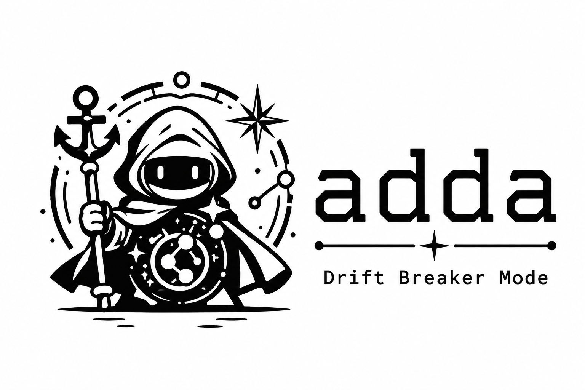

<!-- Developed by - Vedavyas Vayalpadu - vyas4c3@gmail.com -->
<!-- Coded by - Claude Code -->

<p align="center">
  
</p>

<p align="center">
  <i>Your AI forgets your architecture. ADDA remembers it for them.</i>
</p>

<p align="center">
  <sub>Compression shrinks the pipe. ADDA breaks the drift.</sub>
</p>

<p align="center">
  
  
  
  
  
</p>

---

**ADDA** (Anti-Drift Documentation Architecture) finds documentation that has
quietly stopped being true — and tells you what it could not determine.

Missing documentation is visible. Drifted documentation is not: it was true when
written, the code moved, and the file still reads as authoritative. Agents make
this worse in both directions — they generate documentation readily, and they
have no mechanism to notice when what they wrote stopped being true.

## Two minutes, on a repo you already have

No setup, no authored documents, nothing to fill in first:

```bash
pip install adda

adda sync . --map --out adda/MODULE_MAP.json   # route each code path to its doc
adda audit .                                   # what has drifted?
```

```
Doc drift detected: 2 finding(s)
  [high  ] doc missing    docs/modules/session.md
  [high  ] doc missing    docs/modules/limiter.md
```

Write those docs, commit, and `audit` goes quiet. Change the code without
touching its doc, and it comes back:

```
Doc drift detected: 1 finding(s)
  [medium] doc stale      docs/modules/limiter.md
```

It exits non-zero when it finds something, so it drops straight into CI. Make it
a commit gate with `adda hook install`.

**It reports what it cannot determine.** Staleness comes from git commit
ancestry, not a hand-written date — and when two commits are unordered
(divergent branches, a rebase, a shallow clone) the answer is *"cannot tell"*,
reported as a skip rather than a pass. A green check that was structurally blind
is worse than no check.

## The other half: architecture memory

If you want your assistant to *remember* the architecture as well as keep its
docs honest, ADDA is also:

- **ADDA memory** — constraints, modules, decisions and state as markdown in `/adda`, versioned in git. You author it; that is the point.
- **OKF** — compiles that memory to small, provider-agnostic JSON any LLM can read.
- **Context Sentinel** — a token gauge that says *when* to checkpoint, before a compaction wipes your context.

`adda init` scaffolds that layout. It is a bigger commitment than the drift
checks above, and entirely optional — `sync`, `audit` and `hook` never read it.

## Where ADDA fits

A whole class of tools **compresses** what flows to the model — shrinking tool
outputs, file reads, and JSON in the pipe (e.g. [headroom-ai](https://github.com/chopratejas/headroom),
which ADDA wires in optionally). But compression fights the provider's prefix cache
for the *same tokens*, and on cache-heavy agent traffic the cache usually wins —
real-world code reviews land ~4%. ADDA works one layer up: not the bytes in any single
request, but the **persistent, versioned memory** of your architecture across
sessions — a different axis, with no cache to collide with.

That layer is exactly where **drift** lives — and it's the gap compression layers
don't close. ADDA owns it: `adda diff` measures when code has drifted from the docs,
`adda audit` sweeps the whole repo for doc-layer drift the moment it happens, `adda
hook` blocks a commit that introduces it, and `adda eval` measures how much memory
survives a rehydration. ADDA doesn't just **detect** drift — it **enforces** against
it at commit time. Compress the pipe *and* anchor the memory — they stack.

## Before / after

**Before** — you hit `/compact` without a handover:

```text
You:    continue implementing the payment flow
Model:  sure — I'll add a new PaymentService and a fresh DB table...
        (it forgot ADR-0007: "all money lives in the ledger, never a new table")
You:    no. we decided that months ago. it's in the ledger.
        (you spend the next hour re-explaining your own architecture)
```

**After** — `adda rehydrate` restores the memory first:

```bash
adda rehydrate . | your-llm   # minimal OKF: version + constraints + active ADRs + active modules
# memory restored in seconds, ~58% fewer tokens than the full export
```

## 1. Why not just Claude's native Compaction?

Claude 4.x ships built-in **Compaction** that summarizes earlier context server-side
as you approach the window. So why ADDA?

Native compaction is **single-session, single-provider, and opaque**: it lives inside
one conversation, runs only on Claude, and you cannot see, edit, or version what it
chose to keep or drop.

| | Native Compaction | ADDA |
|---|---|---|
| Scope | One conversation | Cross-session — memory lives in git, survives `/clear`, new chats, new machines |
| Provider | Claude only | Cross-LLM — OKF is provider-agnostic JSON; feeds Claude, Codex, anything |
| Transparency | Opaque server summary | Inspectable, editable markdown → JSON |
| History | None | Git-versioned — every constraint/ADR/module change is a reviewable diff |
| Drift | Cannot detect | `adda diff` flags where code diverged from the docs |
| Measurable | No | `adda eval` scores how much memory survives rehydration |

ADDA doesn't compete with Compaction — it can **feed** it: `adda rehydrate` emits a
curated minimal OKF you inject into the model (or into a compaction prompt), so the
session starts from your source-of-truth architecture instead of a lossy auto-summary.

## The closed loop

```
adda monitor  →  warns at 60% context  →  adda checkpoint (snapshot state)
      ↑                                              ↓
 adda rehydrate  ←  (compact happens, memory lost)  ←
```

Monitor → checkpoint → compact → rehydrate. A self-correcting loop against drift.
The north-star is **`adda rehydrate`**: after a compaction, emit the *minimal* OKF to
instantly restore the LLM's architectural memory. A second loop runs alongside it at
commit time: **`adda hook`** blocks a commit that stages code without its doc, and
**`adda audit`** catches whatever the hook didn't (pre-existing drift, files that
predate the gate) on the next repo-wide sweep — detection and enforcement, not
detection alone.

## Install

```bash
pip install -e .
pip install -e ".[headroom]"   # optional compression (heavy; not required)
```

Installs the `adda` console script.


**CI.** `.github/workflows/ci.yml` runs the tests plus `adda diff`, `adda audit` and a `adda eval` assertion that load-bearing fidelity stays at 100%, on Python 3.10 and 3.13. It checks out with `fetch-depth: 0` because `audit` decides staleness from git ancestry and a shallow clone cannot answer that.

## Commands

**Core loop:**

```bash
adda init ./my-project                          # scaffold the /adda layout
adda export ./my-project --okf                  # /adda/*.md -> validated okf.json
adda monitor --tokens 130000 --limit 200000     # 65% -> CHECKPOINT
adda rehydrate ./my-project                     # minimal OKF (pipe into your LLM)
adda checkpoint ./my-project -m "before compact"
```

**Drift breakers:**

```bash
adda sync ./my-project             # derive an ARCHITECTURE skeleton (modules + deps) from the code
adda sync ./my-project --map       # derive MODULE_MAP.json (code -> doc routing) instead
adda diff ./my-project             # detect drift: docs vs actual repo (exit 1 on drift)
adda eval ./my-project             # rehydration fidelity %
```

**Enforcement (v0.3):**

```bash
adda audit ./my-project            # repo-wide doc-layer drift sweep: missing/stale/unmapped/orphaned docs
adda hook install ./my-project     # install a pre-commit gate: blocks staging code without its doc
adda hook run ./my-project         # what the installed hook invokes (staged-vs-staged, no dates, no LLM)
```

`adda init` writes the spec layout: `VERSION.md`, `ARCHITECTURE.md`, `DOMAIN_MODEL.md`,
`API_CONTRACTS.md`, `DECISIONS/`, `STATE/`, `PROMPT_BASE/`. Edit the markdown, then
`adda export` compiles it to `okf.json`. `audit` reads `MODULE_MAP.json` (from `adda
sync --map`) to know which doc each code path owes; `hook install` is what makes the
gate run automatically, not only when someone remembers to type `adda audit`.

## Numbers

Measured 2026-08-27 by `benchmarks/run.py` against real repositories ADDA did not
design. Reproduce with:

```bash
python benchmarks/run.py . ../flask ../django ../date-fns
```

| repo | modules | mapped | exempt | collisions | time | load-bearing | overall | payload cut |
|---|---|---|---|---|---|---|---|---|
| ADDA | 1 | 11 | 1 | 0 | 0.01s | **100.0%** | 86.7% | 46.9% |
| flask | 1 | 21 | 3 | 0 | 0.01s | n/a | n/a | n/a |
| requests | 1 | 18 | 1 | 0 | 0.00s | n/a | n/a | n/a |
| fastapi | 2 | 41 | 7 | 0 | 0.03s | n/a | n/a | n/a |
| django | 3 | 718 | 199 | 0 | 1.14s | n/a | n/a | n/a |
| date-fns | 2 | 1259 | 0 | 0 | 0.65s | n/a | n/a | n/a |

**Zero collisions across 2,068 mapped files.** That number is the point: a doc path
that two code paths share is a module reported as documented while having no
documentation, and the mapping is derived so that cannot happen.

**Why fidelity is `n/a` for most rows, and not filled in.** Rehydration fidelity
scores how much *authored* architecture memory survives `rehydrate`. Real
repositories have none — running `adda init` first would score an empty scaffold,
which measures the template rather than the tool. So it is reported only where real
`/adda` memory exists.

Where it can be measured, load-bearing fidelity is **100%**: `rehydrate` loses none
of the constraints, active modules or in-force decisions while cutting the payload
roughly in half. Overall fidelity sits below 100% by design — dropping prose and
inactive items is the compression trade-off.

## OKF — the format

OKF is the wedge: a small, provider-agnostic JSON format for software-architecture
context ("schema.org for architecture context"). The locked schema (v0.2) is documented
in **[OKF_SCHEMA.md](OKF_SCHEMA.md)**, with ADDA as its reference implementation. The
same JSON feeds any LLM; `adda rehydrate` is the integration surface a future MCP server
or editor skill can expose without changing the format.

## Limitations

Honest about what it does and doesn't do:

- **You still curate.** `adda sync` derives a skeleton from the code, but the constraints, decisions, and prose are yours to write — ADDA won't invent them.
- **`adda diff` matches modules by path/name.** Rename a module without updating its `[path]` and it shows as drift (by design — that *is* drift you should reconcile).
- **`adda eval` is a deterministic content metric**, not an LLM-judged score. It measures which architecture facts survive rehydration, offline and reproducibly — it does not call a model (ADDA is a context tool, not an LLM executor).
- **`--compress` (headroom-ai) is lossy *as ADDA uses it*, and opt-in.** ADDA calls Headroom's library `compress()`, which drops low-signal content. Headroom compression is *reversible* when you run its proxy + MCP retrieve tool (the model can fetch the original back) — ADDA doesn't wire that path, so it keeps `--compress` off by default and always emits faithful, valid OKF.
- **Memory is local git.** No server/MCP yet — that's a deliberate future surface, not built in.

## Smoke test & development

```bash
python scripts/smoke_test.py     # runs the whole closed loop in a temp dir
pip install -e ".[dev]" && pytest -q
```

---

Developed by - Vedavyas Vayalpadu - vyas4c3@gmail.com · Coded by - Claude Code
